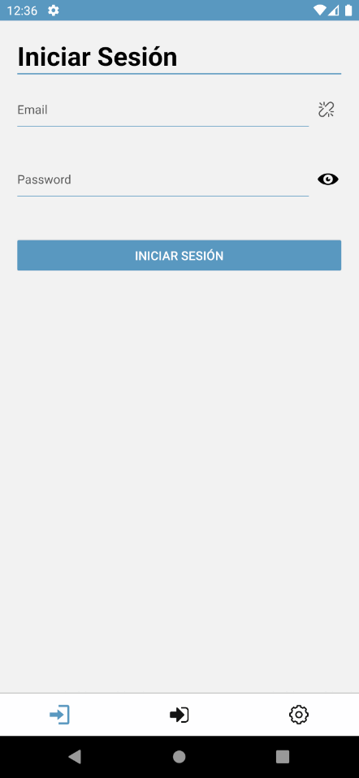

  

# About me

**Software developer with experience in web, mobile and desktop application development. I am currently focused on mobile application development using technologies such as React Native and Kotlin.**

# Tech Stack

**Languages**

  
   
   
   
   

 **Have worked in**

   
    
  
  
  
   
   
   
  
    
   
  
   
   
   
   
   
 
 **Version Control and Development tools used**

  
  
  
  
  

 **Tools to deploy used**

  
  
   
  
  

 **Operanting System familiar with**

  
  
 
|  |  | 
| - | - |

# Featured projects

### **LibraryBlue**

  This project consists of a mobile application for inventory management in a bookstore/library. Allows you to add other bookstores/libraries as associates to share part of the inventory. Additionally, different levels of permissions are implemented for different ranks within the organization. The application allows a quick update of the output records of the articles and has a search engine that allows you to find articles according to seven main tags.
**<a href="https://github.com/MrBluegru/libraryBlue" target="_blank" rel="noreferrer">Read how it was built.</a>**

  

### **Coffee Street**

  It is a virtual store that combines coffee and bakery products. Customers have access to a shopping cart where they can select the desired products. In addition, the option to subscribe to receive news and updates is offered. Users can also create a custom account to manage previous orders and save their favorite products.
**Read how it was built 
<a href="https://github.com/MrBluegru/CoffeeStreet-FrontEnd" target="_blank" rel="noreferrer">Front End</a> and
<a href="https://github.com/MrBluegru/CoffeeStreet-BackEnd" target="_blank" rel="noreferrer">Back End</a>.**

## Contact me on 

